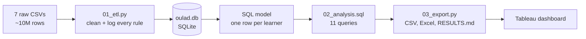

# Learner Journey Analytics: Where Online Learners Drop Off

**When do online learners drop out, and what in their first few weeks predicts it?**

This project follows ~32,000 online learner enrollments, from sign-up to the final result, to answer
the questions an online program team asks about its students:

| Question | Where it's answered |
|---|---|
| How long between signing up and starting, and does signing up late matter? | `q2_registration_timing` |
| How active are learners in their first month ("onboarding")? | `q4_first_month_engagement`, `q4b_activity_before_start` |
| How far do learners get through the course? | `q5_progress`, `q6_weekly_active_by_outcome` |
| When do learners withdraw? | `q3_withdrawal_timing`, `q3b_withdrawal_by_week` |
| How many finish, and who struggles most? | `q0_overview`, `q1_outcomes_by_course`, `q7_segments`, `q8_never_started` |

## Data

[Open University Learning Analytics Dataset (OULAD)](https://archive.ics.uci.edu/dataset/349/open+university+learning+analytics+dataset):
seven related tables covering courses, assessments, learner demographics, registrations and
withdrawals, assessment submissions, and ~10 million rows of daily course-site activity.
Anonymized, public, CC BY 4.0. Download instructions are in [`data/README.md`](data/README.md).

## Pipeline



1. **`01_etl.py`**: loads all seven tables, standardizes them, and writes every cleaning rule and
   the number of rows it touched to `outputs/cleaning_log.csv`. It rebuilds the database from
   scratch on every run, so the whole pipeline is repeatable.
2. **SQL model** (inside `01_etl.py`): rolls ~10 million activity rows up to weekly and per-learner
   engagement, joins everything into one modeled table, `learners`, and checks that the join
   neither adds nor drops a single learner.
3. **`02_analysis.sql`**: eleven queries, each answering one question above.
4. **`03_export.py`**: runs the queries and writes the results to CSV, a single Excel workbook,
   and [`outputs/RESULTS.md`](outputs/RESULTS.md), which is generated from the run and never
   typed by hand.

## Data cleaning

The full log is generated in `outputs/cleaning_log.csv`. The main rules:

- **Duplicates:** exact duplicate rows removed; every table is then checked to have exactly one
  row per key.
- **Inconsistent categories:** a deprivation band written without its `%` sign is standardized.
  Missing bands are labeled `Unknown`, not guessed.
- **Contradictions are flagged, not silently fixed:** learners marked *Withdrawn* with no
  withdrawal date, or the reverse. The final result is treated as the source of truth, and the
  flagged rows are left out only of the analysis that needs the date.
- **Carried-over work excluded:** "banked" assessment results come from a previous attempt, so
  they don't count toward this run's progress.
- **Invalid values removed:** activity rows with zero or negative clicks, and submissions to
  assessments that don't exist.
- **Integrity check:** the modeled `learners` table must have the same row count as the source
  learner table. A join that adds or drops rows is treated as a bug.

## Key findings

> _Fill this in from `outputs/RESULTS.md` after running the pipeline. For each finding, give
> one line each for what the data shows, what it means, and what you'd recommend._

1. **Finding:** …
   **So what:** …
   **Recommendation:** …
2. …
3. …

## Dashboard

See [`dashboard/`](dashboard/). _Add the Tableau Public link and a screenshot._

## Limitations

- **Correlation, not causation.** Low early activity predicts withdrawal, but it doesn't prove
  that raising activity would prevent it.
- **One institution, UK, 2013–2014.** The patterns are a starting point for another program,
  not a substitute for its own data.
- **Clicks measure activity, not learning.** A learner can download everything once and study
  offline.
- **No marketing funnel.** The dataset starts at registration. [`optional/ga4_checkout_funnel.sql`](optional/ga4_checkout_funnel.sql)
  sketches the landing-page-to-checkout half using Google's public GA4 sample data in BigQuery.

## Run it

```bash
pip install -r requirements.txt
# put the 7 OULAD CSVs in data/raw/  (see data/README.md)
python3 01_etl.py      # ~2-4 minutes; builds oulad.db and the cleaning log
python3 03_export.py   # runs every query, writes outputs/
```

## Tools

Python (pandas), SQL (SQLite), Excel, Tableau Public.

## Acknowledgments

Data: Kuzilek, J., Hlosta, M., & Zdrahal, Z. (2017). *Open University Learning Analytics dataset.*
Scientific Data 4, 170171.

Code was developed with AI assistance (Claude). I ran the pipeline, validated the outputs against
the raw data, built the dashboard, and wrote the findings.
